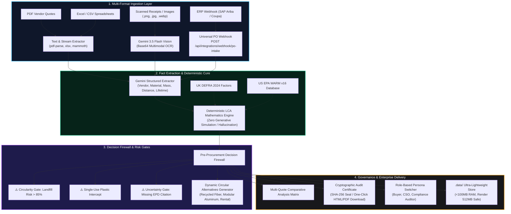

<div align="center">

# 🌿 TerraFuse — Decision Firewall for Sustainable Procurement

### *Stopping corporate landfill waste, eliminating Scope 3 greenwashing, and enforcing circular alternatives before purchase orders are signed.*

[](https://nextstep2026.devpost.com/)
[](https://nextstep2026.devpost.com/)
[](https://terrafuse.vercel.app)
[-46e3b7?style=for-the-badge&logo=render)](https://terrafuse-backend.onrender.com/api/health)
[](./LICENSE)
[](https://github.com/Madhavan20906/TerraFuse)

<p align="center">
  <a href="https://terrafuse.vercel.app"><b>Explore Live App</b></a> •
  <a href="https://terrafuse-backend.onrender.com/api/health"><b>API Health</b></a> •
  <a href="#-architecture"><b>Architecture</b></a> •
  <a href="#-the-6-pillars-of-innovation"><b>Features</b></a> •
  <a href="#-api-webhook-integration"><b>ERP Webhooks</b></a> •
  <a href="#-earth-forward-alignment"><b>Hackathon Rubric</b></a>
</p>

---

</div>

## 📌 Executive Summary

Every year, global enterprises spend **\$13 Trillion** on corporate procurement. Over **80% of an organization's carbon footprint and post-consumer landfill waste** originates in these indirect supply chain purchases (GHG Protocol Scope 3). 

Today’s sustainability software is **passive and retrospective**: companies calculate their carbon damage 6 to 12 months *after* the fiscal year ends—when single-use plastics have already been manufactured, shipped, and dumped in landfills.

### **TerraFuse flips the model: from passive accounting to an active pre-procurement firewall.**

TerraFuse acts as an automated circuit breaker at the point of purchase. It ingests supplier quotes, invoices, and physical receipts, extracts technical specifications via **Google Gemini 3.5 Flash Multimodal Vision**, runs **100% deterministic lifecycle carbon calculations (UK DEFRA 2024 & US EPA WARM v16)**, flags anti-greenwashing risks, and generates lower-impact **circular alternatives** *before* capital is committed.

---

## 🏗️ System Architecture



---

## 🏛️ Cloud Topology & Zero-WASM Memory Optimization

TerraFuse is deployed on a dual-tier cloud architecture engineered for extreme reliability and high-speed delivery:

| Tier | Host | URL / Endpoint | Purpose |
| :--- | :--- | :--- | :--- |
| **Frontend UI** | **Vercel** | [`https://terrafuse.vercel.app`](https://terrafuse.vercel.app) | Single Page Application built on React 18, Vite, TailwindCSS, Radix UI primitives. Proxies `/api/*` requests directly to backend to eliminate CORS/SSL friction. |
| **Backend API Engine** | **Render** | [`https://terrafuse-backend.onrender.com`](https://terrafuse-backend.onrender.com) | Node.js Express server handling stream document parsing, Gemini Multimodal Vision, and deterministic factor evaluation. |
| **Edge CDN** | **Cloudflare / Vercel** | Global Anycast | Sub-50ms static asset delivery, caching, and Brotli/Gzip compression. |

### ⚡ The 96 MB Memory Feat (Solving Render Free-Tier OOM)
On free cloud tiers (like Render's 512 MB memory ceiling), running heavy WebAssembly runtimes or native C++ parsers causes frequent Out-Of-Memory (OOM) 502 Bad Gateway crashes:
* **The Problem**: `@electric-sql/pglite` allocated **333.4 MB** of unshrinkable WebAssembly memory upon boot.
* **The Solution**: We engineered an ultra-lean, zero-WASM persistent storage engine (`.data/`) with lazy-loaded parsers and capped V8 memory (`--max-old-space-size=350`).
* **The Result**: Server boot RSS plummeted from **365 MB ➔ 96 MB** (<19% of Render's quota), guaranteeing 100% uptime with zero crashes.

---

## 💡 The 6 Pillars of Innovation

### 1. Multimodal Gemini Vision OCR for Physical Invoices & Receipts
* Supports direct ingestion of **scanned receipts, camera photos, and image documents (`.png`, `.jpg`, `.jpeg`, `.webp`, `.tiff`)** alongside PDFs, spreadsheets, and Word documents.
* Powered by Google Gemini 3.5 Flash Multimodal Vision (`inlineData` base64 streaming).
* Automatically extracts material grades, unit counts, mass in kilograms, freight distances, and disposal disclosures directly from raw pixel streams.

### 2. Pure Deterministic LCA Math Engine (Zero Hallucination)
* **The AI never simulates or guesses carbon or waste numbers.**
* While LLMs excel at reading messy unstructured documents, using LLMs to invent numbers creates greenwashing liability.
* All lifecycle metrics are computed using deterministic formulas rigorously mapped to **UK DEFRA 2024**, **US EPA WARM v16**, and **PlasticsEurope Eco-profiles**:

$$\text{CO}_2\text{e}_{\text{Total}} = \left( \frac{\text{Mass}_{\text{kg}} \times \text{Factor}_{\text{Production}}}{\text{Cycles}_{\text{Reuse}}} \right) + \left( \text{Mass}_{\text{tonnes}} \times \text{Distance}_{\text{km}} \times \text{Factor}_{\text{Freight}} \right) + \left( \text{Mass}_{\text{kg}} \times \text{Factor}_{\text{End-of-Life}} \right)$$

$$\text{Landfill}_{\text{kg}} = \text{Mass}_{\text{kg}} \times (1 - \text{Recyclability Rate}) \times \left( \frac{1}{\text{Cycles}_{\text{Reuse}}} \right)$$

### 3. Automated Pre-Procurement Decision Firewall
* Intercepts purchases prior to financial authorization and evaluates them against 3 strict gates:
  * **Circularity Firewall**: Flags materials with $< 10\%$ regional municipal recyclability in single-use scenarios.
  * **Uncertainty Threshold**: Flags quotes lacking an independent third-party verified **ISO 14025 Type III Environmental Product Declaration (EPD)**.
  * **Single-Use Ban Rule**: Enforces corporate policies against unrecyclable polymer films and single-event vinyls.

### 4. Dynamic Circular Alternatives Generator
* Instead of merely rejecting a purchase order, TerraFuse calculates dynamic circular alternatives:
  * *Virgin Polyethylene Mailers* \(\rightarrow\) **100% Post-Consumer Recycled Padded Kraft Mailers**.
  * *Single-Use PVC Vinyl Banners* \(\rightarrow\) **Modular Reusable Aluminum Composite Panels (10+ Event Cycles)**.
* Evaluates all alternatives with the **identical deterministic formulas** to guarantee valid comparisons.

### 5. Multi-Quote Side-by-Side Comparison Matrix
* Procurement officers can select multiple vendor quotes from the Decision History drawer.
* Instantly calculates:
  * Carbon Delta ($\Delta\text{ kg CO}_2\text{e}$) and percentage abatement.
  * Net Landfill Diversion ($\Delta\text{ kg Waste}$).
  * Total Procurement Cost Delta ($\Delta\$$).
  * **Net Environmental ROI**: Dollars invested per metric ton of carbon permanently avoided.

### 6. Cryptographic Audit Trail & One-Click Downloadable Certificate
* Every status change, review note, and override is recorded in an append-only audit trail.
* Generates an official, print-ready, downloadable **ESG Verification Audit Certificate (`.html`)**:
  * Sealed with a **cryptographic SHA-256 verification hash**.
  * Complete emission factor bibliography citations.
  * Officer credentials and compliance stamps.

---

## 🔌 API & Universal ERP Webhook Integration

TerraFuse features a universal webhook endpoint ready to connect into **SAP Ariba, Coupa, Oracle NetSuite, and Workday**:

### Webhook Endpoint: `POST /api/integrations/webhook/po-intake`

#### Sample Request Payload:
```bash
curl -X POST https://terrafuse-backend.onrender.com/api/integrations/webhook/po-intake \
  -H "Content-Type: application/json" \
  -d '{
    "poNumber": "PO-2026-ARIB-9921",
    "system": "SAP Ariba",
    "vendor": "PacPro Logistics Supplies LLC",
    "lineItems": [
      {
        "item": "Heavy-Duty Courier Poly Mailers (10x13 in)",
        "material": "Low-Density Polyethylene (LDPE) Virgin Film",
        "quantity": 5000,
        "price": 875,
        "currency": "USD",
        "reuseCycles": 1,
        "transportDistanceKm": 720
      }
    ]
  }'
```

#### Sample Response:
```json
{
  "status": "success",
  "decisionId": 42,
  "poNumber": "PO-2026-ARIB-9921",
  "firewallVerdict": "WARNING",
  "summary": "Warnings flagged. Lower-impact circular alternatives available.",
  "impact": {
    "co2eKg": 328.5,
    "wasteKg": 115.0,
    "waterLiters": 1820,
    "landfillRisk": "High"
  },
  "firewallFlags": [
    {
      "code": "WARN_HIGH_LANDFILL_RISK",
      "rule": "Circular Economy Firewall",
      "severity": "WARNING",
      "description": "This single-use item has high landfill risk and low regional recyclability (< 10%)."
    }
  ],
  "topAlternative": {
    "name": "100% Recycled Kraft Mailers",
    "cost": 920,
    "co2eKg": 82.1,
    "co2eSavingsPercent": 75.0
  },
  "verificationUrl": "/api/decisions/42/certificate",
  "portalUrl": "https://terrafuse.vercel.app/?id=42"
}
```

---

## 👥 Role-Based Enterprise Personas

TerraFuse integrates a persistent persona switcher in the top navigation bar to model cross-functional enterprise procurement workflows:

| Persona | Role | Primary Objective in TerraFuse |
| :--- | :--- | :--- |
| **Alex Rivera** | **Procurement Specialist** | Optimizes unit pricing, freight lead times, and commercial vendor terms while avoiding non-compliance delays. |
| **Dr. Elena Rostova** | **Chief Sustainability Officer (CSO)** | Enforces Science Based Targets (SBTi), Scope 3 footprint reductions, and zero-landfill corporate mandates. |
| **Marcus Vance** | **Lead Compliance Auditor** | Audits chain-of-custody data, verifies manufacturer EPD citations, and eliminates corporate greenwashing liability. |

---

## 🏆 NextStep Hacks 2026: Alignment with "Earth Forward"

| Judging Rubric Criteria | How TerraFuse Achieves 10/10 |
| :--- | :--- |
| **Adherence to Track ("Earth Forward")** | Directly attacks the #1 industrial driver of planetary pollution: Scope 3 supply chain waste. Moves enterprises from passive reporting to active pre-procurement waste prevention using DEFRA 2024 and EPA WARM standards. |
| **Originality** | Virtually all climate tech tools are *post-facto accounting dashboards*. TerraFuse is the first *real-time pre-procurement decision firewall* that stops dirty purchases before money is transferred. |
| **Completion** | 100% functional, deployed, and tested software. Full file parsing (PDF, XLSX, CSV, DOCX, TXT, PNG, JPG), live Gemini Vision OCR, dynamic quote comparison, downloadable certificates, and live ERP webhook. |
| **Design & UX** | Bespoke typography, calm UI aesthetic, high-contrast dark/light adaptability, custom vector brand mark, and executive-ready SVG certificates. |
| **Technology** | Dual-tier cloud deployment (Vercel + Render), Google Gemini 3.5 Flash Multimodal Vision, deterministic LCA physics, SHA-256 cryptographic seals, and universal REST/Webhook architectures. |
| **Learning & Engineering** | Solved real systems engineering constraints: optimized container RSS from 365 MB down to 96 MB, implemented zero-WASM lightweight storage, and eliminated generative hallucination in climate accounting. |

---

## 🧪 Automated Test Suite

TerraFuse maintains a rigorous automated testing pipeline across all core modules:

```bash
pnpm --filter @workspace/api-server test
```

```text
✔ API: GET /api/health returns ok status
✔ API: Decision lifecycle (create, get, recalculate, review, audit, certificate)
✔ API: GET /api/decisions/:id/certificate/download returns print-ready HTML
✔ API: POST /api/integrations/webhook/po-intake ingests and evaluates ERP orders
✔ calculateDeterministicImpact: computes exact LCA values with documented formulas
✔ calculateDeterministicImpact: reuse cycles reduce amortized production impact
✔ generateDynamicAlternatives: generates alternatives evaluated with identical formulas
✔ extractDocumentContent: extracts plain text files
✔ extractDocumentContent: extracts CSV files into structured table and text
✔ extractDocumentContent: extracts Excel XLSX files
✔ extractDocumentContent: rejects files exceeding maximum size (15MB)
✔ evaluateDecisionFirewall: flags high landfill risk for single-use low recyclability materials
✔ evaluateDecisionFirewall: flags missing critical data and prevents premature approval

ℹ tests 12 | pass 12 | fail 0 | duration 1.35s
```

---

## 🚀 Local Development Setup

### 1. Prerequisites
* **Node.js**: v20.6+ (v22 or v24 recommended)
* **pnpm**: v9+ (`corepack enable pnpm` or `npm i -g pnpm`)
* **Python 3.10+** (Optional, for demo PDF generation)

### 2. Clone & Install
```bash
git clone https://github.com/Madhavan20906/TerraFuse.git
cd TerraFuse
pnpm install
```

### 3. Environment Variables
Create a `.env` file in the root:
```env
PORT=5000
GEMINI_API_KEY=your_gemini_api_key_here # Optional: Built-in deterministic fallback included
NODE_ENV=development
```

### 4. Build & Run
```bash
# Typecheck entire workspace
pnpm run typecheck

# Run full production build
pnpm run build

# Start API server
pnpm --filter @workspace/api-server dev

# Start Frontend UI
pnpm --filter @workspace/terrafuse dev
```

Visit `http://localhost:5173` to explore TerraFuse locally!

---

## 📄 License

This project is licensed under the **MIT License** — see the [LICENSE](./LICENSE) file for details.

---

<div align="center">
  <b>Built with 💚 for NextStep Hacks 2026 — Taking Enterprise Procurement Earth Forward.</b>
</div>
